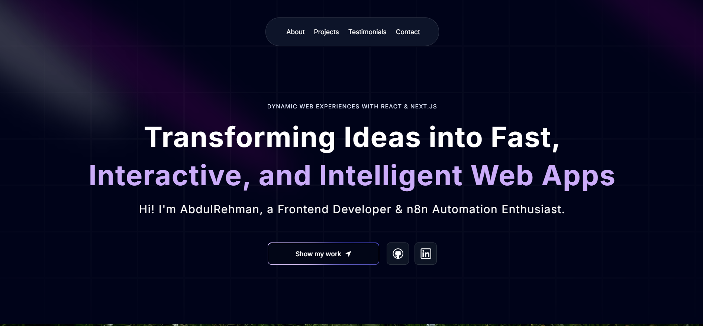

<div align="center">
  <br />
  <a href="https://abdulrehman-rana-portfolio.netlify.app" target="_blank">
    
  </a>
  <br />

  <div>
    
    
    
    
  </div>

  <h3 align="center">AbdulRehman Rana — Personal Portfolio</h3>

  <div align="center">
    Frontend Developer & n8n Automation Engineer based in Pakistan.<br/>
    <a href="https://abdulrehman-rana-portfolio.netlify.app" target="_blank"><b>View Live</b></a>
  </div>
</div>

---

## 📋 Table of Contents

1. [Introduction](#introduction)
2. [Tech Stack](#tech-stack)
3. [Features](#features)
4. [Quick Start](#quick-start)

---

## 🤖 Introduction

My personal developer portfolio built with Next.js, Three.js, Framer Motion, and Tailwind CSS. It showcases my web development work, n8n automation projects, and professional experience with 3D elements, smooth animations, and a fully responsive layout.

---

## ⚙️ Tech Stack

- **Next.js 14**
- **Three.js** + **React Three Fiber**
- **Framer Motion**
- **Tailwind CSS**
- **Lottie React**
- **Vercel** (deployment)

---

## 🔋 Features

- **Hero Section** — Spotlight effect with animated background
- **Bento Grid** — Personal info and traits in a modern card layout
- **3D Globe** — Interactive 3D globe built with Three.js
- **Projects** — Web apps and n8n automation projects in separate tabs
- **Work Experience** — Professional timeline with ShopXR and LineSquare
- **Testimonials** — Scrolling testimonial cards
- **Approach Section** — Canvas effect with 3-phase development process
- **Fully Responsive** — Optimized across all screen sizes and devices

---

## 🤸 Quick Start

**Prerequisites**

Make sure you have the following installed:

- [Git](https://git-scm.com/)
- [Node.js](https://nodejs.org/en)
- [npm](https://www.npmjs.com/)

**Clone the repository**

```bash
git clone https://github.com/abdulrehman6417/portfolio-new.git
cd portfolio-new
```

**Install dependencies**

```bash
npm install
```

**Run locally**

```bash
npm run dev
```

Open [http://localhost:3000](http://localhost:3000) in your browser.

---

## 📬 Contact

- **Portfolio:** [abdulrehman-rana-portfolio.netlify.app](https://abdulrehman-rana-portfolio.netlify.app)
- **LinkedIn:** [linkedin.com/in/abdulrehman-rana](https://linkedin.com/in/abdulrehman-rana)
- **GitHub:** [github.com/abdulrehman6417](https://github.com/abdulrehman6417)
- **Email:** abdulrehman6417.rana@gmail.com
